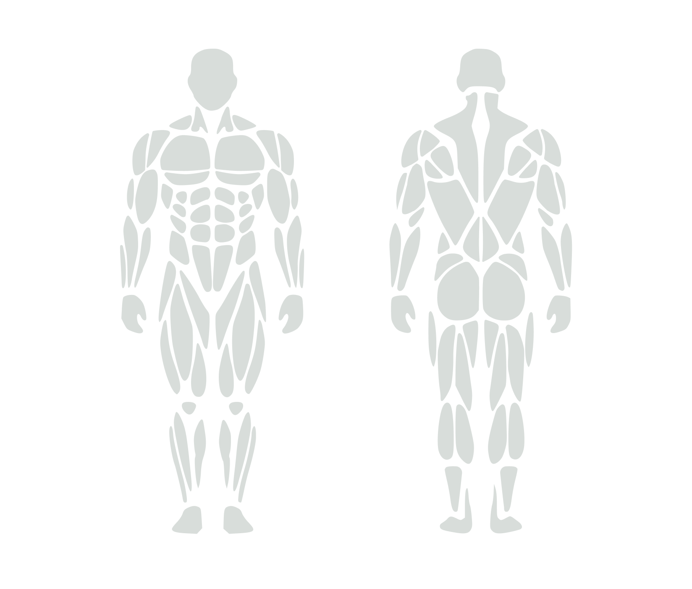
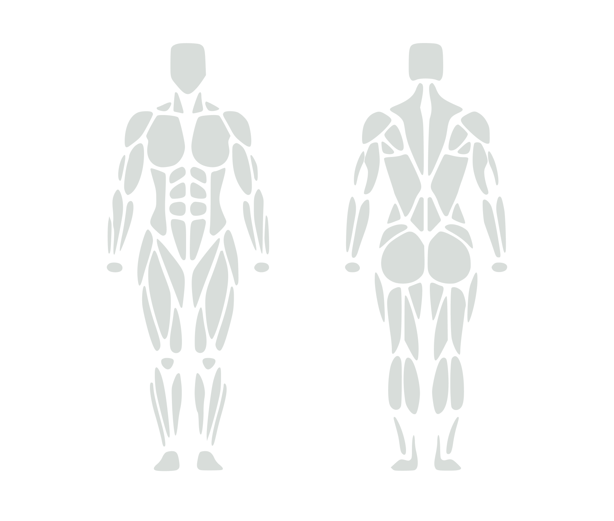

# Body Map

Starter workspace for an open source body map project built from pure SVG assets.

## Preview

### Male



### Female



## Structure

```text
body-map/
  README.md
  react/
    components/
    demo/
  svg/
    female-body.svg
    male-body.svg
```

## Goals

- Keep the source assets as plain SVG.
- Make the files easy to edit in code or vector tools.
- Use these starter bodies as the base for future interactive regions, muscle groups, pain points, or training overlays.

## Current Assets

- `svg/male-body.svg`: combined male front and back layout, side by side.
- `svg/female-body.svg`: combined female front and back layout, side by side.
- `react/components/`: React wrappers for the same combined body assets.
- `react/demo/`: standalone React demo app entrypoint and styles.

## Local Demo

Run the demo from inside `body-map/`:

```bash
cd react/demo
npm install
npm run dev
```

The runnable Vite app now lives entirely in `react/demo/` and renders the hover-tooltips UI using the components from `react/components/`.

## Notes

- These SVGs were derived from the live body map code in the app, so they match the current body artwork instead of the earlier placeholder silhouettes.
- The raw SVG files use a neutral fill color for easy editing and export workflows.
- The React components use `currentColor`, so you can recolor them with CSS or inline styles.
- Every path includes `data-muscle` and `data-muscle-id` so consumers can attach hover, selection, tooltip, and analytics behavior without relying on CSS classes.

## Next Ideas

- Split SVGs into named body regions.
- Export a metadata map from muscle IDs to labels.
- Add framework-agnostic package packaging around `svg/` and `react/`.
- Add an MIT license.
- Publish as its own repository or package once the asset set is stable.
