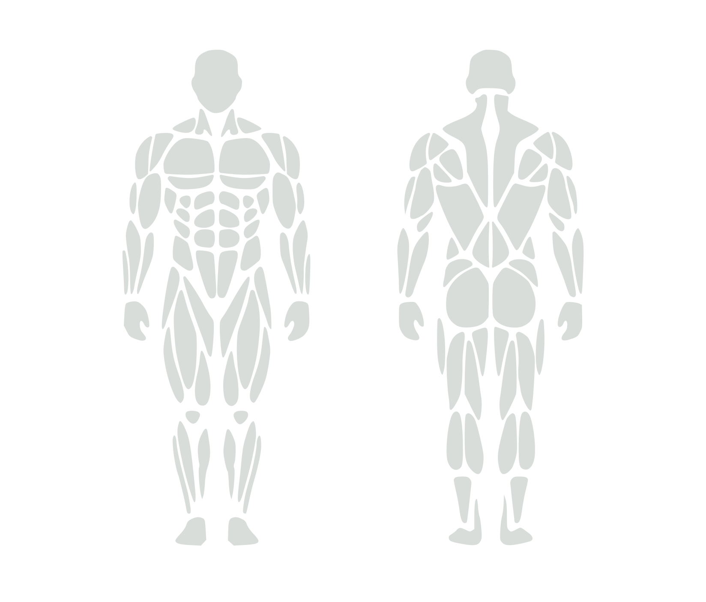
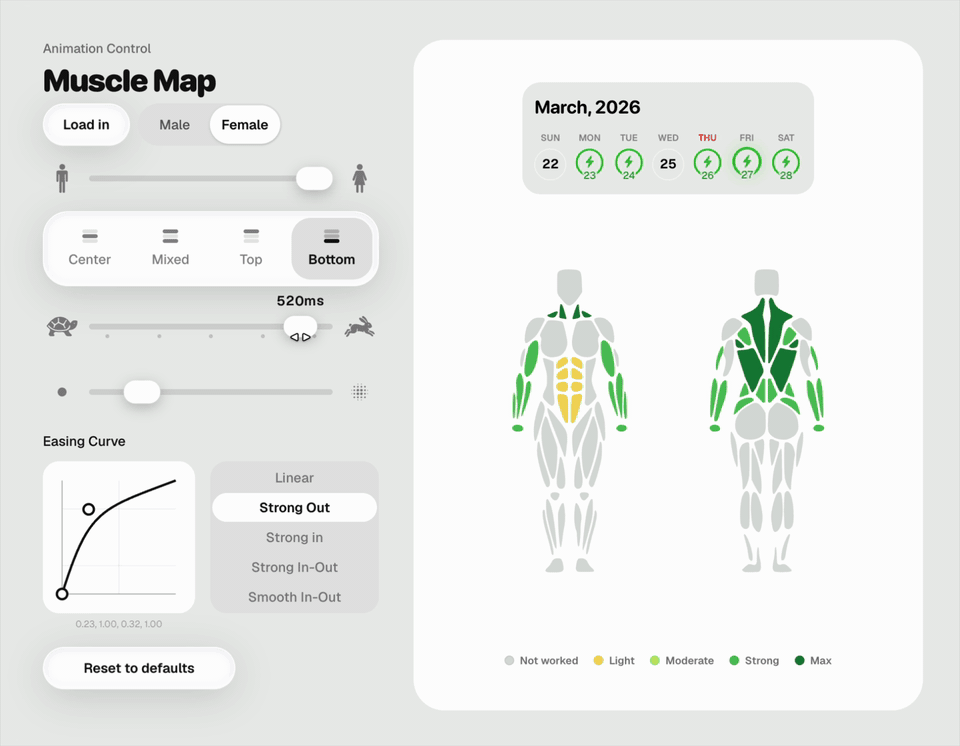

# Body Map

An interactive React muscle map backed by editable anatomical SVG assets. The main demo lets you enter an exercise, estimate muscle activation, inspect individual muscle groups, and tune the reveal and breathing animations.



## Quick start

Requirements: Node.js 20 or newer and npm.

```bash
npm install
cp .env.example .env.local
npm run dev
```

Open the URL printed by Vite. The map still renders without a backend; exercise search and AI estimates require `VITE_CONVEX_URL` in `.env.local`.

## Commands

```bash
npm run dev        # start the Vite development server
npm run build      # type-check and create a production build
npm run typecheck  # run TypeScript without building the app
npm test           # run the state-machine tests
npm run preview    # serve the production build locally
```

## Project layout

```text
body-map/
├── src/                 # production Muscle Map application
├── public/              # app icons copied into the Vite build
├── svg/                 # framework-independent body SVGs
├── png/                 # static body previews
├── react/
│   ├── components/      # lightweight reusable React body components
│   └── demo/            # animation playground for those components
├── gif/ and mp4/        # interaction recordings
├── .env.example         # example Convex endpoint configuration
└── package.json         # main app scripts and dependencies
```

The root package is the full interactive experience. The files under `react/components` are intentionally smaller building blocks for projects that only need the male or female SVG body without search, estimation, or the animation controls.

## Using the React body components

The component barrel exports `MaleBody`, `FemaleBody`, and `BodyMapDemo`:

```tsx
import { MaleBody } from "./react/components";

export function Example() {
  return <MaleBody style={{ width: "100%", color: "#d8ddda" }} />;
}
```

Every anatomical path has `data-muscle` and `data-muscle-id` attributes, so consumers can add hover, selection, tooltip, or analytics behavior without depending on generated CSS classes. The paths use `currentColor`, allowing the neutral body color to be controlled by CSS or React props.

To run the lightweight component playground separately:

```bash
cd react/demo
npm install
npm run dev
```

## Exercise estimation

Copy `.env.example` to `.env.local` and set the Convex deployment used by the app:

```dotenv
VITE_CONVEX_URL=https://your-deployment.convex.cloud
```

The browser calls the `exerciseEstimation:searchLandingExercises` query for autocomplete and `exerciseEstimation:estimateLandingMuscles` for estimates. Results are cached locally. The URL is a public client-side endpoint, so do not put secrets in any `VITE_*` variable.

## Raw assets

- `svg/male-body.svg` and `svg/female-body.svg` contain combined front and back views.
- `png/` contains ready-to-use preview renders.
- `gif/` and `mp4/` show muscle selection, ripple, and transition behavior.

The source SVGs use neutral fills for easy editing. The React versions use `currentColor` and retain muscle metadata on each path.

## Demo recordings

### Muscle selection


[MP4 version](./mp4/muscle-selection-demo.mp4)

### Ripple effect


[MP4 version](./mp4/ripple-demo.mp4)

### Transitions



[MP4 version](./mp4/transition-demo.mp4)

### Muscle usage

The exercise flow and muscle-usage visualization are available as a browser-friendly H.264 video:

<video controls muted playsinline width="420" src="./mp4/muscle-usage-demo.mp4"></video>

[Watch or download the MP4](./mp4/muscle-usage-demo.mp4) · [Original MOV](./mp4/muscle-usage-demo.mov)

## Notes

- The root Vite config uses a relative base path, so the production build can be served from a subdirectory.
- AI estimation is optional; the body map, manual controls, and bundled animation demos work locally without it.
- `react/components` is source code rather than a published npm entry point. Add a library build and package exports before publishing this repository to npm.
